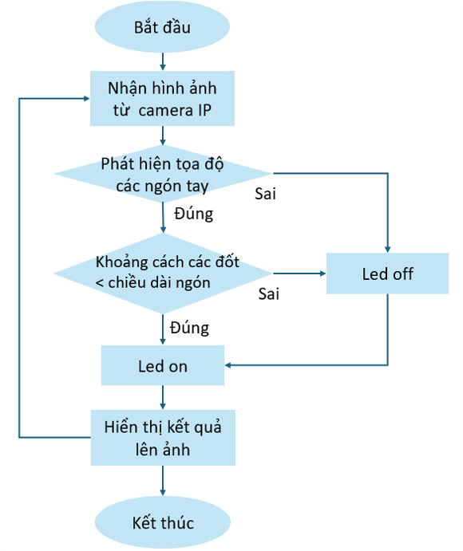

# Finger_detection_with-Jetson_Nano

Update Jetson nano
```
sudo apt update && sudo apt upgrade -y
```
Need to install python3.8 because mediapipe library is supported from 3.8 and above
```
sudo apt install python3.8
```
Install pip tool
```
sudo apt-get install python3.8-pip
```
Install dependencies
```
sudo apt-get install -y libopencv-core-dev libopencv-highgui-dev libopencv-calib3d-dev libopencv-features2d-dev libopencv-imgproc-dev libopencv-video-dev
```
Install mediapipe library
```
pip3.8 install mediapipe
```
Run
```
python3.8 handTracking.py
```


